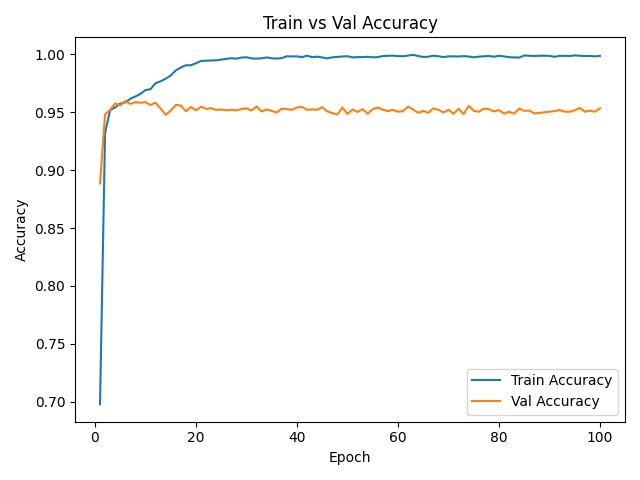
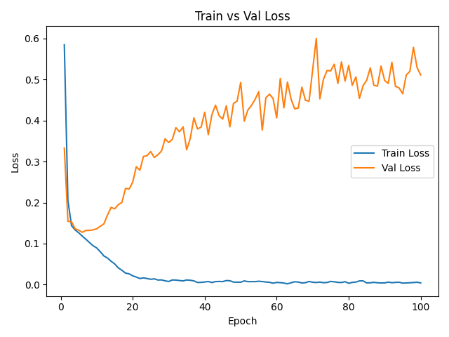
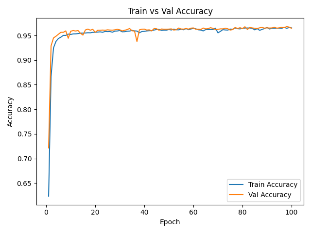
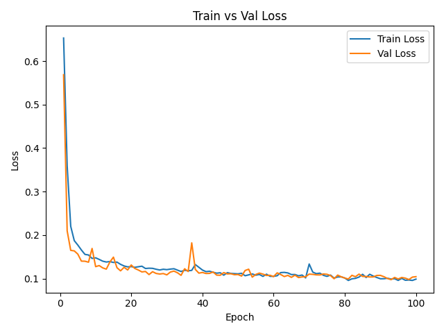

# Malaria Cell Image Classification

This project uses the Kaggle **Cell Images for Detecting Malaria** dataset to classify cell images as parasitized or uninfected. A simple convolutional neural network (CNN) is implemented to perform the classification task. The primary goal is to study the influence of data augmentation on model performance; the model is trained and evaluated both with and without augmentation, and the resulting training curves are analyzed to highlight the benefits of augmentation techniques.

---

## Model Architecture

Our classifier is a simple, lightweight convolutional neural network designed to distinguish parasitized from uninfected malaria cells. It begins with three successive convolutional blocks—each block consists of a convolution layer followed by a ReLU activation and spatial downsampling via max pooling—to extract hierarchical image features. The resulting feature maps are then flattened and passed through two fully connected layers (with dropout between them) to learn high‑level representations, culminating in a single output logit. We train with binary cross‑entropy loss on these logits to optimize classification accuracy.

---

## Data Augmentation

To improve generalization and reduce overfitting, we randomly flip each training image horizontally with a 50% chance, rotate it by up to ±15°, and apply small random translations (up to 10% of image dimensions) combined with scaling variations ranging from 80% to 120%. These augmentations are applied in conjunction with our standard preprocessing steps to increase the diversity of the training data, which encourages the model to learn more robust and invariant features.

---

## Experimental Results

### Without Augmentation
<p align="center">
    
</p>
<p align="center">
    <em>Figure 1: Training and validation accuracy curves without data augmentation.</em>
</p>

<p align="center">
    
</p>
<p align="center">
    <em>Figure 2: Training and validation loss curves without data augmentation.</em>
</p>

- **Accuracy:** As shown in Figure 1, training accuracy quickly rises to nearly 100%, while validation accuracy plateaus around 95% and shows a slight downward drift over epochs, indicating overfitting.
- **Loss:** As illustrated in Figure 2, training loss steadily decreases toward zero, but validation loss starts increasing after approximately 10 epochs—a classic sign of overfitting.

### With Augmentation

<p align="center">
    
</p>
<p align="center">
    <em>Figure 3: Training and validation accuracy curves with data augmentation.</em>
</p>

<p align="center">
    
</p>
<p align="center">
    <em>Figure 4: Training and validation loss curves with data augmentation.</em>
</p>


- **Accuracy:** As shown in Figure 3, both training and validation accuracy curves converge around 95–96% and remain closely aligned throughout training. The small fluctuations reflect the random augmentations, but overall, the curves demonstrate improved generalization compared to training without augmentation.
- **Loss:** As illustrated in Figure 4, training and validation loss decrease together and stabilize at similar low values (~0.10), without the increase in validation loss observed in the non-augmented case.

**Conclusion:** Data augmentation significantly reduces overfitting by introducing more varied examples, leading to more stable and generalizable performance on unseen data.

---

## Installation Instructions

1. **Install dependencies:**

   ```powershell
   .\install_deps.ps1
   ```

   For Linux:

   ```bash
   ./install_deps.sh
   ```

2. **Activate the virtual environment:**

   ```powershell
   .\venv\Scripts\Activate.ps1
   ```

   For Linux:

   ```bash
   source venv/bin/activate
   ```

---

## Downloading the Dataset

Before running the data download script, ensure you have set up your Kaggle API token. Follow the [Kaggle API documentation](https://www.kaggle.com/docs/api) and place your `kaggle.json` in `~/.kaggle/`.

To download and split the dataset:

```bash
python data/scripts/download_data.py
```

---

## Configuration and Training

Customize parameters in `src/config.py`, then train:

```bash
python src/train.py
```

Checkpoints and logs will be saved in `outputs/`.

---

## Evaluation

After training, evaluate with:

```bash
python src/evaluate.py
```

---

## Acknowledgements

This project uses the [**Cell Images for Detecting Malaria** dataset](https://www.kaggle.com/datasets/iarunava/cell-images-for-detecting-malaria) on Kaggle by Iarunava. We gratefully acknowledge the dataset creators for enabling this research.
