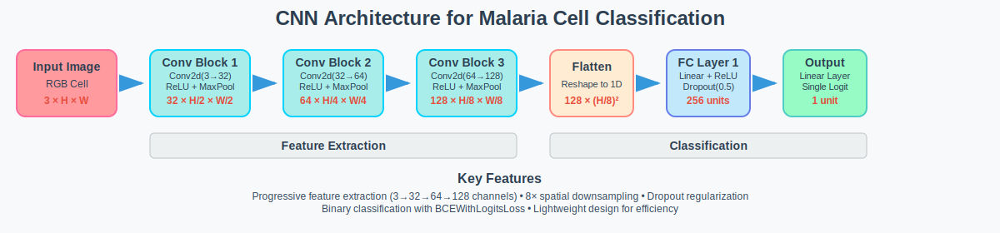

# Malaria Cell Image Classification

This project uses the Kaggle **Cell Images for Detecting Malaria** dataset to classify cell images as parasitized or uninfected. A simple convolutional neural network (CNN) is implemented to perform the classification task. The primary goal is to study the influence of data augmentation on model performance; the model is trained and evaluated both with and without augmentation, and the resulting training curves are analyzed to highlight the benefits of augmentation techniques.

---

## Model Architecture

Our classifier is a lightweight convolutional neural network designed to distinguish parasitized from uninfected malaria cells through hierarchical feature extraction and binary classification.

```
Input Image → Conv Block 1 → Conv Block 2 → Conv Block 3 → Flatten → FC1 → FC2 → Output
(3×H×W)      (32×H/2×W/2)   (64×H/4×W/4)   (128×H/8×W/8)   (1D)     (256)  (1)   Logit
```

### Architecture Components

| Layer | Operation | Input → Output | Parameters |
|-------|-----------|----------------|------------|
| **Conv Block 1** | Conv2d + ReLU + MaxPool2d | 3×H×W → 32×H/2×W/2 | kernel=3×3, padding=1, pool=2×2 |
| **Conv Block 2** | Conv2d + ReLU + MaxPool2d | 32×H/2×W/2 → 64×H/4×W/4 | kernel=3×3, padding=1, pool=2×2 |
| **Conv Block 3** | Conv2d + ReLU + MaxPool2d | 64×H/4×W/4 → 128×H/8×W/8 | kernel=3×3, padding=1, pool=2×2 |
| **Flatten** | Reshape to 1D | 128×H/8×W/8 → 128×(H/8)² | - |
| **FC1** | Linear + ReLU + Dropout | flattened_dim → 256 | dropout=0.5 |
| **FC2** | Linear | 256 → 1 | Binary classification logit |

### Key Features

- **Lightweight Design**: Simple architecture optimized for efficiency
- **Progressive Feature Extraction**: Channel depth increases (3→32→64→128) while spatial dimensions decrease (8× total downsampling)
- **Regularization**: 50% dropout between fully connected layers prevents overfitting
- **Binary Classification**: Single output logit with BCEWithLogitsLoss for parasitized vs. uninfected classification

### Architecture Diagram

<p align="center">
    
</p>

### Training Configuration

- **Loss Function**: Binary Cross-Entropy with Logits (`BCEWithLogitsLoss`)
- **Optimization**: Adam optimizer with learning rate scheduling
- **Input**: RGB cell images normalized to [0,1]
- **Output**: Single logit (sigmoid applied during inference for probability)
---

## Data Augmentation

To improve generalization and reduce overfitting, we randomly flip each training image horizontally with a 50% chance, rotate it by up to ±15°, and apply small random translations (up to 10% of image dimensions) combined with scaling variations ranging from 80% to 120%. These augmentations are applied in conjunction with our standard preprocessing steps to increase the diversity of the training data, which encourages the model to learn more robust and invariant features.

---

## Experimental Results

### Without Augmentation
<p align="center">
    
</p>
<p align="center">
    <em>Figure 1: Training and validation accuracy curves without data augmentation.</em>
</p>

<p align="center">
    
</p>
<p align="center">
    <em>Figure 2: Training and validation loss curves without data augmentation.</em>
</p>

- **Accuracy:** As shown in Figure 1, training accuracy quickly rises to nearly 100%, while validation accuracy plateaus around 95% and shows a slight downward drift over epochs, indicating overfitting.
- **Loss:** As illustrated in Figure 2, training loss steadily decreases toward zero, but validation loss starts increasing after approximately 10 epochs—a classic sign of overfitting.

### With Augmentation

<p align="center">
    
</p>
<p align="center">
    <em>Figure 3: Training and validation accuracy curves with data augmentation.</em>
</p>

<p align="center">
    
</p>
<p align="center">
    <em>Figure 4: Training and validation loss curves with data augmentation.</em>
</p>


- **Accuracy:** As shown in Figure 3, both training and validation accuracy curves converge around 95–96% and remain closely aligned throughout training. The small fluctuations reflect the random augmentations, but overall, the curves demonstrate improved generalization compared to training without augmentation.
- **Loss:** As illustrated in Figure 4, training and validation loss decrease together and stabilize at similar low values (~0.10), without the increase in validation loss observed in the non-augmented case.

**Conclusion:** Data augmentation significantly reduces overfitting by introducing more varied examples, leading to more stable and generalizable performance on unseen data.

---

## Installation Instructions

1. **Install dependencies:**

   ```powershell
   .\install_deps.ps1
   ```

   For Linux:

   ```bash
   ./install_deps.sh
   ```

2. **Activate the virtual environment:**

   ```powershell
   .\venv\Scripts\Activate.ps1
   ```

   For Linux:

   ```bash
   source venv/bin/activate
   ```

---

## Downloading the Dataset

Before running the data download script, ensure you have set up your Kaggle API token. Follow the [Kaggle API documentation](https://www.kaggle.com/docs/api) and place your `kaggle.json` in `~/.kaggle/`.

To download and split the dataset:

```bash
python data/scripts/download_data.py
```

---

## Configuration and Training

Customize parameters in `src/config.py`, then train:

```bash
python src/train.py
```

Checkpoints and logs will be saved in `outputs/`.

---

## Evaluation

After training, evaluate with:

```bash
python src/evaluate.py
```

---

## Acknowledgements

This project uses the [**Cell Images for Detecting Malaria** dataset](https://www.kaggle.com/datasets/iarunava/cell-images-for-detecting-malaria) on Kaggle by Iarunava. We gratefully acknowledge the dataset creators for enabling this research.
